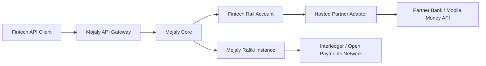

# Mojaly High-Level Pitch Architecture

Mojaly is structured as a platform around one public fintech API and multiple execution paths.

```text
Fintech
  -> Mojaly API Gateway
  -> Mojaly Core
  -> Route Decision
  -> Rafiki/Open Payments or Hosted Partner Adapter
  -> Settlement and Webhooks
```

## Main Components

### API Gateway

Receives fintech API requests, authenticates API keys, validates payloads, and forwards valid requests to Mojaly Core.

### Mojaly Core

Handles quotes, route selection, payment orchestration, and business rules.

### Rafiki Integration

Provides Mojaly's Open Payments and Interledger execution path.

### Partner Adapter

Connects non-Rafiki partners such as banks and mobile-money providers to Mojaly's internal payment flow.

### Settlement Service

Tracks settlement batches, reconciliation, partner reports, and settlement status.

### Webhook Service

Delivers payment and settlement events back to fintechs.

### Ledger Service

Future service for TigerBeetle account and transfer operations.

## Diagram



## How It Works

1. A fintech signs up, completes KYB, and gets API keys.
2. Mojaly provisions the fintech with approved corridors and settlement rules.
3. The fintech creates quotes and payments through Mojaly's unified API.
4. Mojaly Core selects the best available route:
   - bank partner,
   - mobile-money partner,
   - or Open Payments / ILP route through Rafiki.
5. Partner adapters translate Mojaly's normalized payment instruction into the partner's API.
6. Partners confirm payout status by callback or settlement report.
7. Mojaly reconciles partner reports and sends webhook updates back to the fintech.
