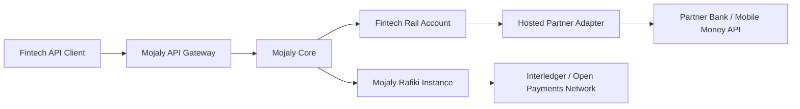

# Mojaly Project Overview

This document introduces Mojaly for anyone new to the codebase: what it is, the problem it exists to solve, and the shape of the solution.

## What Mojaly Is

Mojaly is a unified payment infrastructure layer for African fintechs operating across multiple countries and payment rails. It gives fintechs one programmable API to reach liquidity providers, banks, mobile money networks, and Interledger (ILP) peers across Africa, instead of a separate integration per partner per market.

Mojaly runs a hosted Open Payments and Interledger layer on top of Rafiki. Externally, the Interledger network sees Mojaly. Internally, Mojaly routes to whichever rail actually moves the money.

```text
Fintech -> Mojaly API
Mojaly -> partner liquidity, bank rails, mobile money, or ILP peers
```

## Problem Statement

To operate across corridors today, a fintech must maintain, per corridor:

- one API integration per aggregator
- one prefunded float account per market
- separate reconciliation logic and conditions per partner
- separate regulatory handling (settlement windows, KYC rules, capital requirements, AML thresholds)

Four corridors means four APIs, four float accounts, four reconciliation systems, and 6+ months of integration work.

```text
Fintech -> Bank Kenya API
Fintech -> Bank Tanzania API
Fintech -> Mobile money API
Fintech -> FX partner API
```

### Cost of the problem

For a fintech processing $10M/month across 5 countries:

- $333K tied up in transit at any given moment
- $75–125K annual cost of idle capital
- 3–7 days average settlement time per transaction
- 4–10x separate API integrations to maintain
- 12–18+ months to enter a new market from scratch
- $500K–2M+ per-market integration cost

## Solution

Mojaly replaces the fragmented infrastructure with a unified platform: connect once, use only one liquidity account and get instant access to liquidity providers and Interledger-enabled partners across Africa.

```text
Fintechs
  -> Mojaly API / dashboard / docs
    -> Mojaly orchestration and routing
      -> Rafiki for Open Payments and ILP peers
      -> Hosted ILP rails for non-ILP partners
      -> Partner adapters for banks and mobile money
      -> Settlement and reconciliation services
```

Core capabilities:

- **One API integration** — connect once, access multiple payment rails across countries
- **Intelligent payment routing** — automatically routes through the most efficient bank, payment provider, or Interledger path
- **Unified liquidity access** — simplifies liquidity access across markets through a single platform
- **Hosted Open Payments & Interledger layer** — makes both ILP-enabled and non-ILP partners reachable through the same infrastructure
- **Unified settlement & reconciliation** — single view of transactions, balances, settlements, and reporting across markets
- **Developer-first platform** — APIs, webhooks, SDKs, docs, and dashboards for rapid integration

### Hosted ILP partner model

Partners that do not run Rafiki or ILP can still be represented on the Interledger network, connecting to Mojaly through their normal bank, API, or settlement rails.

```text
Mojaly is the ILP connector/provider.
The partner behind Mojaly may or may not run ILP.
```

```text
Fintech or ILP peer
  -> Mojaly Open Payments / Rafiki / Connector
    -> Hosted partner route
      -> Partner adapter
        -> Bank API / mobile money API / payout rail
```

### Why Rafiki matters

Rafiki is Mojaly's Open Payments and Interledger engine: wallet addresses, GNAP authorization, ILP packet handling, peer configuration, liquidity accounting, routing, and webhook events. Rafiki is not the whole product, Mojaly also owns:

- fintech onboarding, KYB/KYC
- developer portal, partner onboarding
- partner adapter framework
- liquidity facility management
- settlement batching, reconciliation
- risk limits, pricing and fees
- operational dashboards

### Partner types

- `ILP_PEER` — runs Rafiki or another ILP connector; Mojaly peers with them directly
- `HOSTED_ILP_RAIL` — non-ILP partner represented through Mojaly's Open Payments layer
- `BANK_ADAPTER` — bank connected via banking API, settlement file, or dashboard
- `MOBILE_MONEY_ADAPTER` — mobile money provider/aggregator via payout/collection API
- `SETTLEMENT_PARTNER` — used mainly to settle obligations, even if not the payout destination

### Tenant, Partner, Peer

- **Tenant** — a fintech/client using Mojaly
- **Partner** — a bank, ASE, mobile money provider, liquidity provider, or settlement provider helping Mojaly execute payments
- **Peer** — a partner also connected to Mojaly via Interledger/Rafiki peering

A bank can be partner-only, partner + ILP peer, or partner + tenant — these roles are modeled separately.

### Routing model

```text
If the route is an ILP peer:
  use Rafiki / ILP routing

If the route is a hosted non-ILP partner:
  use Mojaly's hosted ILP representation
  then execute through the partner adapter

If the route is a direct non-ILP rail:
  execute directly through the adapter
```

The fintech sees one Mojaly API and one payment status model regardless of which path was used.

### Result

- 4–10 integrations -> 1 integration
- 12–18 months -> weeks to launch
- $500K–2M+ per market -> single settlement view

Mojaly targets a $329B TAM in African cross-border payments (growing to $1T by 2035, 12% CAGR), a $20M–$75M SAM across 400–500 fintechs needing multi-rail settlement, and a $7M SOM from 100 fintech clients across 5 key markets. Long term, Mojaly can become a regional Interledger Service Provider and Africa's settlement infrastructure layer: one account, every rail, no float trapped.

## Target Architecture
