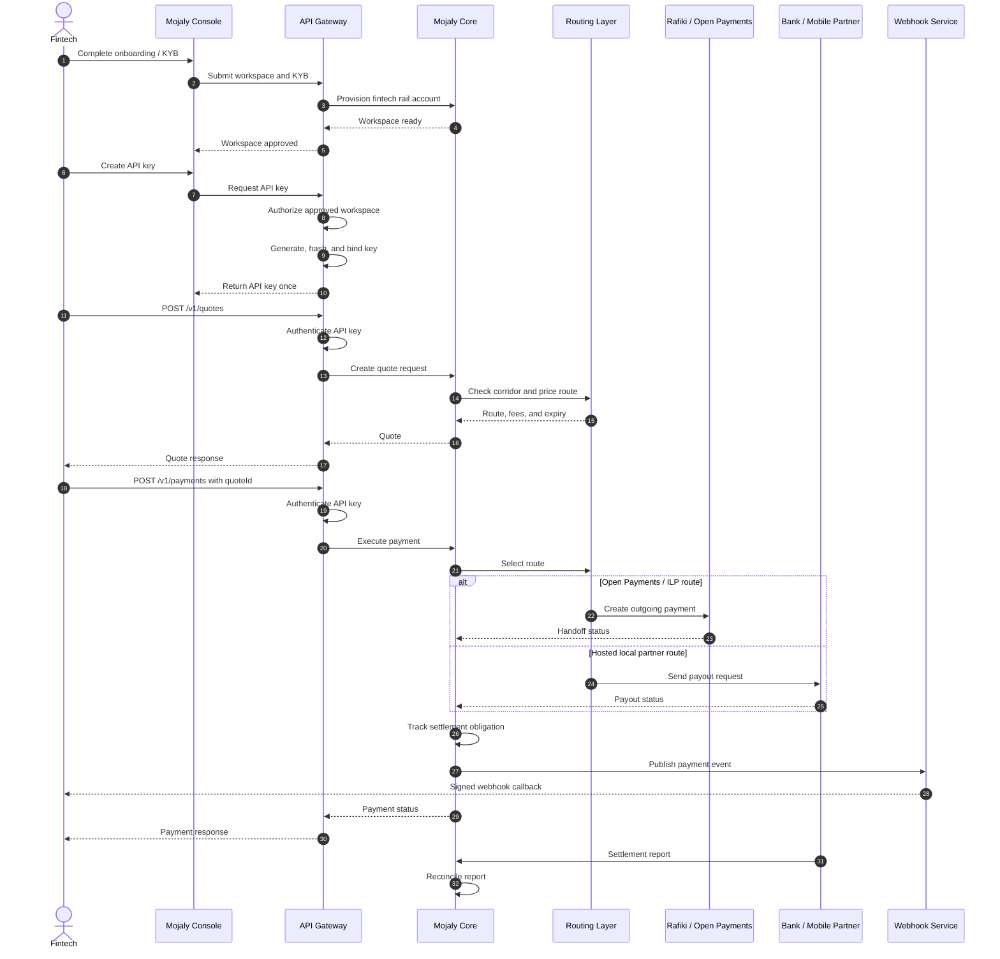

# Mojaly Sequence Diagram

## Presentation Summary

The fintech only sees Mojaly's API Gateway. Behind that, Mojaly authenticates the API key, checks the allowed corridor, prices the route, chooses either Rafiki/Open Payments or a hosted partner adapter, executes the payment, tracks settlement, and sends webhook events back to the fintech.

