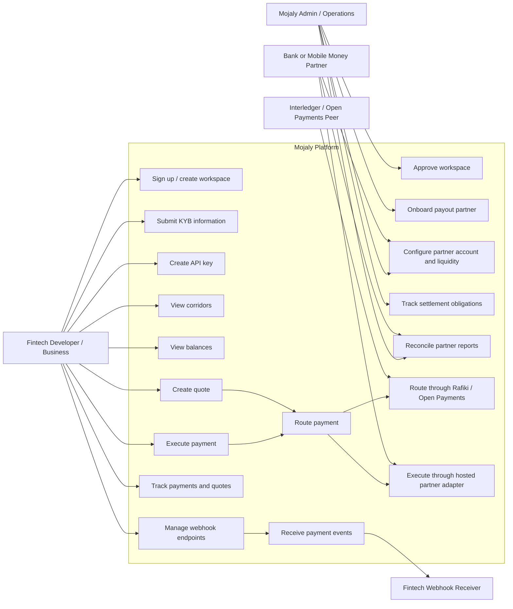
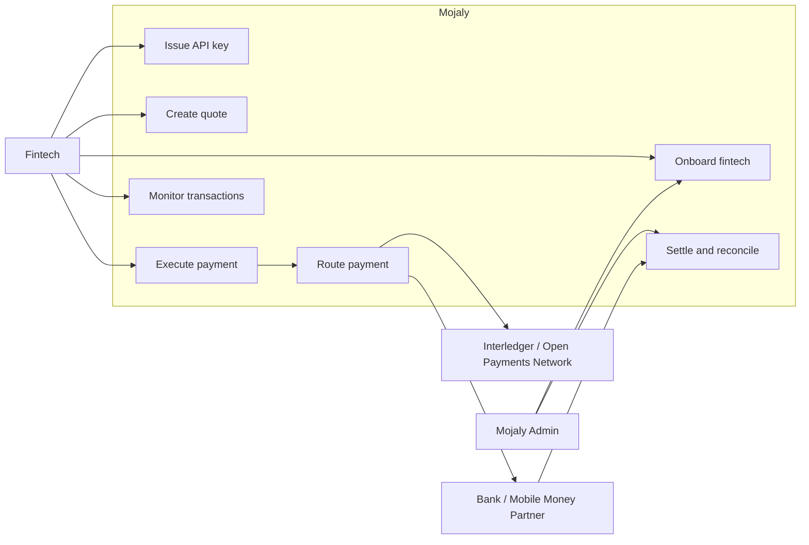

# Mojaly Use Case Diagram

## Main Actors

- **Fintech Developer / Business**: integrates with Mojaly, creates API keys, creates quotes, executes payments, and monitors activity.
- **Mojaly Admin / Operations**: approves KYB, configures partners, monitors settlement, and runs reconciliation.
- **Bank or Mobile Money Partner**: provides local payout capability, liquidity/capacity, and settlement reports.
- **Interledger / Open Payments Peer**: connects through Rafiki/Open Payments when the route is Interledger-enabled.
- **Fintech Webhook Receiver**: receives signed payment and settlement events from Mojaly.

## Main Use Cases

- Onboard a fintech workspace.
- Approve KYB and unlock API keys.
- Discover available corridors and balances.
- Create a quote.
- Execute a payment.
- Route through Rafiki/Open Payments or hosted partner adapters.
- Track transactions, quotes, request logs, and settlement.
- Send webhooks to the fintech.
- Reconcile partner settlement reports.

# Mojaly Simple Use Case Diagram

## Short Explanation

Fintechs integrate once with Mojaly, get an API key, create quotes, execute payments, and monitor transactions.

Mojaly routes each payment either through a local bank/mobile-money partner or through Interledger/Open Payments when the route supports it.

Mojaly Admin handles onboarding approval, partner operations, settlement, and reconciliation.

