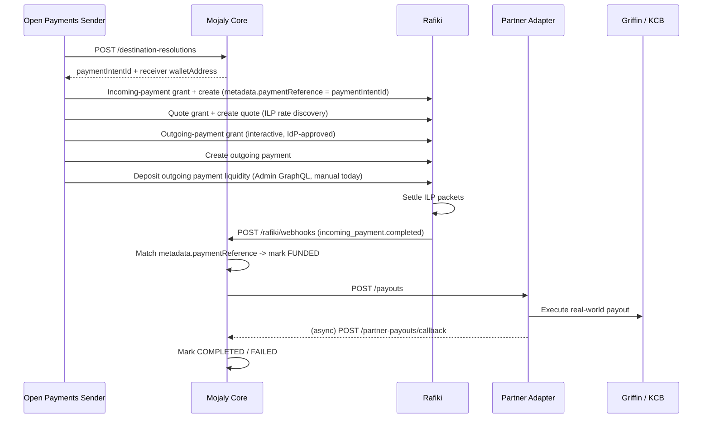

# Open Payments Flow

This is the actual Open Payments handshake Mojaly exercises today, reconstructed from the working end-to-end script at `integrations/open-payments-client/src/run-real-rafiki-flow.ts`. That script is the closest thing this repo has to an integration test for the Rafiki/ILP path: it runs against a real local Rafiki instance (`infrastructure/rafiki`) and drives the exact sequence Core and a real Open Payments client would use.

## Actors

- **Sender wallet** — an Open Payments client with keys registered on a Rafiki wallet address (`setup-sender.ts` provisions this against Rafiki's Admin GraphQL: finds/creates the asset, tenant, wallet address, and registers a test keypair).
- **Receiver wallet** — one of Mojaly's hosted partner settlement wallet addresses (e.g. `https://mojaly.local/griffin/settlement`), resolved by Core.
- **Mojaly Core** (`services/core`) — resolves the destination and reacts to Rafiki's webhook once funds arrive.
- **Rafiki** — GNAP auth server + Open Payments resource server + ILP connector (see [rafiki-role.md](rafiki-role.md)).
- **Partner adapter** (`services/partner-adapter`) — executes the real-world payout once Core confirms funding.

## Step by step

### 1. Resolve the destination (Mojaly-specific, not part of Open Payments)

The client calls Mojaly first, not Rafiki:

```text
POST {CORE_URL}/destination-resolutions
{ fintechId, destination: { type, country, account, bankCode?, network?, name? }, amount, reference }
```

`destination-resolutions.service.ts` resolves a `PartnerRoute` (country + destination type + network + asset code) and creates a `PaymentIntent` in `AWAITING_PAYMENT` status. The response carries the pieces the client needs to start the Open Payments flow:

```text
{ paymentIntentId, walletAddress, paymentReference, partnerCode, status, expiresAt }
```

`walletAddress` here is the Rafiki-hosted **receiver** wallet address for that partner (e.g. Griffin's or MTN Uganda's settlement wallet) — this is the correlation point between "an ILP payment happened" and "which Mojaly payment intent it belongs to."

### 2. Resolve sender and receiver wallet addresses

Standard Open Payments wallet address lookup (`client.walletAddress.get`) against both the sender's own wallet address and the `walletAddress` returned in step 1. This returns each wallet's `authServer` and `resourceServer` URLs plus its asset code/scale.

### 3. Incoming-payment grant + incoming payment

A non-interactive GNAP grant against the **receiver's** auth server for `incoming-payment` access, then:

```text
POST {receiver.resourceServer}/incoming-payments
{ walletAddress, incomingAmount, expiresAt, metadata: { paymentReference: <paymentIntentId>, mojalyReference } }
```

`metadata.paymentReference` is set to the Mojaly `paymentIntentId` from step 1. This is the field Core later reads back out of the webhook to know which payment intent got funded — it is the entire link between Rafiki's payment lifecycle and Mojaly's own.

### 4. Quote grant + quote

A non-interactive GNAP grant against the **sender's** auth server for `quote` access, then `client.quote.create` with `method: 'ilp'`, pointing at the incoming payment created in step 3. This is where ILP rate discovery happens — see [interledger-role.md](interledger-role.md) for what the quote actually represents.

### 5. Outgoing-payment grant (interactive)

This grant is interactive by design (GNAP requires user/IdP consent before a sender's funds can be debited):

```text
POST {sender.authServer}/  (grant request)
  access_token.access: [{ type: 'outgoing-payment', actions: [...], identifier, limits: { debitAmount } }]
  interact: { start: ['redirect'], finish: { method: 'redirect', uri, nonce } }
```

Rafiki returns a `redirect` URL to a consent screen backed by Kratos (`infrastructure/rafiki/kratos.yml`). In the demo script this is approved programmatically (`approveLocalInteraction`) using the tenant's `idpSecret` against Rafiki-auth's interaction API — standing in for a human clicking "approve" in Rafiki's real interaction UI. After approval, the client follows the `finish` redirect to extract an `interact_ref`, then calls `client.grant.continue(...)` to exchange it for a finalized access token.

### 6. Create the outgoing payment

```text
POST {sender.resourceServer}/outgoing-payments
{ walletAddress: sender.id, quoteId }
```

### 7. Deposit outgoing payment liquidity

Rafiki requires an explicit liquidity deposit before it will move an outgoing payment forward. The demo script does this directly through Rafiki's Admin GraphQL (`rafiki-admin-payments.ts` → `depositOutgoingPaymentLiquidity`), signed the same way Core signs its own Admin GraphQL calls (see [rafiki-role.md](rafiki-role.md)).

**This step is currently manual/operator-driven in this codebase** — there is no automated handler reacting to an `outgoing_payment.created` webhook and depositing liquidity on Mojaly's behalf. (A handler like that exists as unused reference code in `services/core/src/modules/rafiki/service.ts`, but it isn't wired up — see the note in [rafiki-role.md](rafiki-role.md).) Today, whoever runs the sender side is responsible for this step.

### 8. Rafiki settles the payment

Rafiki moves the ILP packets from sender to receiver wallet address. The incoming payment eventually reaches its `incomingAmount` and completes.

### 9. Rafiki notifies Mojaly Core

Rafiki calls Mojaly's webhook endpoint:

```text
POST /rafiki/webhooks   (services/core/src/modules/rafiki-webhooks/rafiki-webhooks.routes.ts)
{ id, type: "incoming_payment.completed", data: { ..., metadata: { paymentReference } } }
```

`rafiki-webhooks.service.ts` ignores every event type except `incoming_payment.completed`, pulls `data.metadata.paymentReference` back out (the same value written in step 3), and calls `handleFundingConfirmed(paymentReference)` in `services/core/src/modules/payment-processing`.

### 10. Core triggers the real-world payout

`handleFundingConfirmed`:

1. Looks up the `PaymentIntent` by that reference, guards against already-processed intents, and marks it `FUNDED`.
2. Calls `createPartnerPayout` (`services/core/src/clients/partner-adapter.client.ts`) → `POST {PARTNER_ADAPTER_URL}/payouts` on `services/partner-adapter`.
3. Marks the intent `PAYOUT_SUBMITTED` (or `FAILED` if the adapter call throws).

`services/partner-adapter`'s `payouts.service.ts` looks up the registered adapter for `partnerCode` (Griffin or KCB today — `partner-registry.ts`) and calls its `createPayout`, which talks to the real bank/mobile-money vendor API.

### 11. Partner confirms the payout

The partner adapter (or the vendor's own callback, e.g. `vendors/kcb/kcb.callback.routes.ts`) eventually reports a terminal status back to Core:

```text
POST /partner-payouts/callback   (services/core/src/modules/partner-payout-callbacks)
{ paymentIntentId, adapterPayoutId, status: PENDING | COMPLETED | FAILED, failureReason? }
```

`handlePartnerPayoutStatus` moves the payment intent to its terminal state: `COMPLETED` or `FAILED`.

## End-to-end summary



## Known gaps

- Liquidity deposit for outgoing payments (step 7) is not automated — Core has no webhook handler for `outgoing_payment.created`/`outgoing_payment.completed`/`outgoing_payment.failed` today. Only `incoming_payment.completed` is handled.
- There's no quote/rate comparison across partners before routing — the destination resolution step picks a partner by static capability lookup, not by the ILP quote's exchange rate (see [scope.md](../01-foundation/scope.md)).
- The GNAP interaction approval in step 5 is only proven out via the local script's direct call to Rafiki-auth's interaction API using the tenant `idpSecret`; there's no fintech-facing UI for a real end-user consent screen yet.
