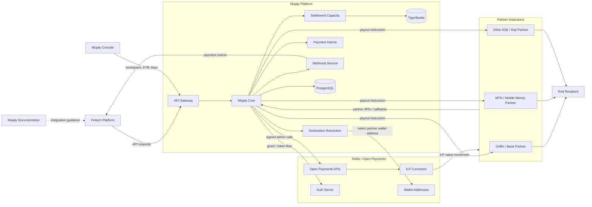

# Architecture Overview

Mojaly is structured as a platform around one public fintech API and multiple execution paths.

## Main Components

### API Gateway

Receives fintech API requests, authenticates API keys, validates payloads, and forwards valid requests to Mojaly Core.

### Mojaly Core

Handles quotes, route selection, payment orchestration, and business rules.

### Rafiki Integration

Provides Mojaly's Open Payments and Interledger execution path.

### Partner Adapter

Connects non-Rafiki partners such as banks and mobile-money providers to Mojaly's internal payment flow.

### Settlement Service

Tracks settlement batches, reconciliation, partner reports, and settlement status.

### Webhook Service

Delivers payment and settlement events back to fintechs.

### Ledger Service

Future service for TigerBeetle account and transfer operations.
