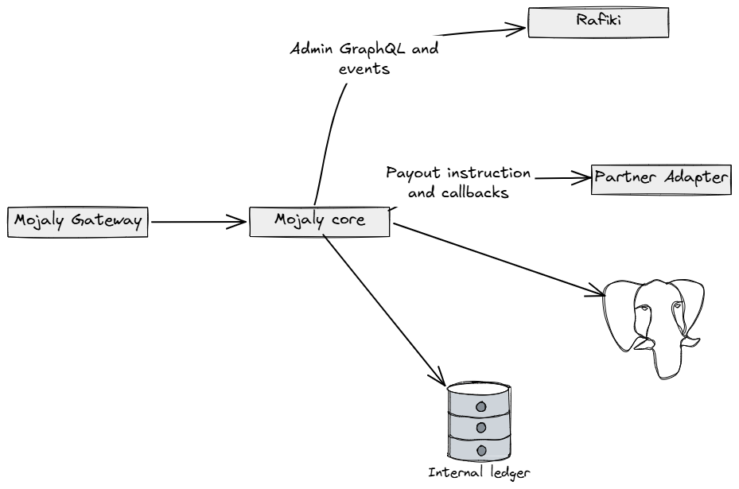

# Core Service

Mojaly Core is the business coordination layer of the Mojaly platform. It sits between the Mojaly Gateway, Rafiki, and partner adapter services.

Core does not replace Rafiki. Rafiki remains responsible for Open Payments, wallet addresses, grants, and Interledger connectivity. Core adds Mojaly-specific business logic around fintech workspaces, partner routes, destination resolution, payment state, and settlement coordination.

## Responsibilities

Mojaly Core is responsible for:

- resolving fintech payment destinations into partner-backed wallet routes
- tracking payment intent state
- coordinating with Rafiki through signed Admin GraphQL requests
- receiving Rafiki payment lifecycle events
- coordinating partner payout execution
- recording payment and settlement state for reconciliation

## Architecture



## How Core Uses Rafiki

Core uses Rafiki as the Open Payments and Interledger infrastructure layer.

The verified integration so far is:

```text
Mojaly Core -> Rafiki Admin GraphQL -> Rafiki assets
```

This proves that Core can make signed operator requests to Rafiki. The next part of the integration is to connect Mojaly payment intents to Rafiki payment lifecycle events.

## How Core Uses Partners

Partners represent banks, mobile-money providers, or other financial institutions that can provide local payout reach.

Core does not contain vendor-specific partner API logic. Instead, Core sends normalized payout instructions to partner adapter services. Each adapter is responsible for translating Mojaly's internal request into the partner's API format.

## Payment Intent Model

Core uses a payment intent to connect three things:

- the fintech's original request
- the Open Payments route selected by Mojaly
- the final local payout destination

This is necessary because the final recipient may not have an Open Payments wallet address. Mojaly resolves that destination to a partner route while still preserving the original recipient details for payout.

## Storage

Core uses PostgreSQL for business state such as fintechs, partners, routes, payment intents, and payout records.

The internal ledger is planned for settlement capacity, reservations, transfers, reversals, and fee accounting.

## Current Status

The Core Service currently includes:

- destination resolution
- partner route lookup
- payment intent state
- partner payout callbacks
- signed Rafiki Admin GraphQL access

The next implementation focus is:

- Rafiki payment event handling
- partner-backed payout execution after Rafiki events
- persistent partner route and payment intent storage
- settlement-capacity tracking
