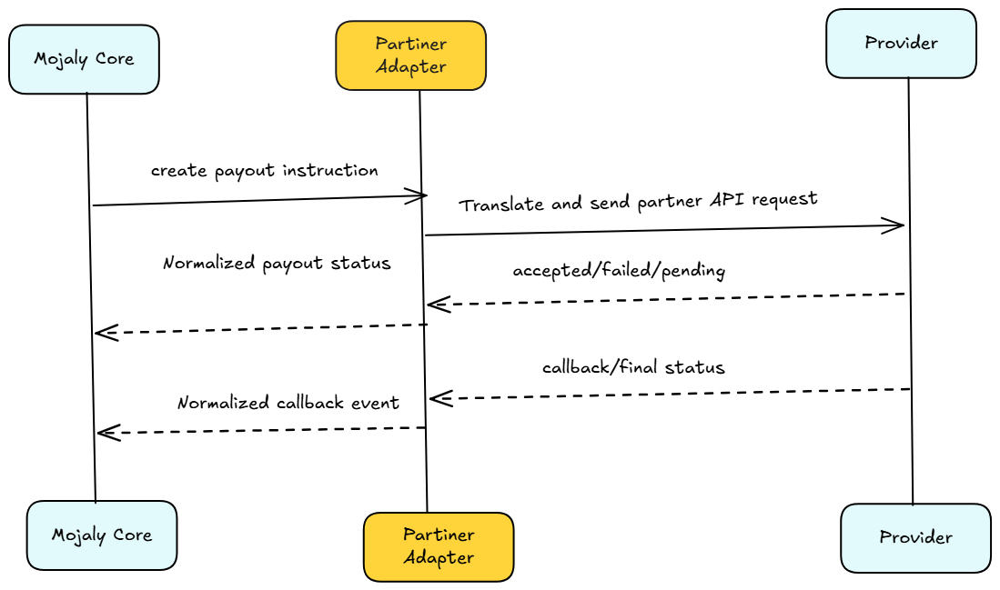

# Partner Adapters

Partner adapters connect Mojaly to financial institutions that do not run Rafiki or expose Open Payments directly.

Examples of partners include:

- banks
- mobile-money providers
- payment aggregators
- e-money institutions
- regulated payout providers

Adapters allow Mojaly to use these institutions as payout and settlement partners while keeping Rafiki and Open Payments at the center of the platform.



## Why Partner Adapters Exist

Open Payments works best when the receiving party is reachable through a wallet address. In many real markets, the final recipient may only have a local destination such as:

- a mobile-money number
- a bank account
- a wallet on a local network
- a payout identifier controlled by a partner

Mojaly resolves these destinations to partner-backed routes. The adapter is responsible for translating Mojaly's internal payout instruction into the partner's API format.

## Role in the Platform

A partner adapter is responsible for:

- calling the partner's payout API
- translating Mojaly payout requests into partner-specific request bodies
- normalizing partner responses
- receiving partner callbacks
- reporting payout status back to Mojaly Core
- exposing partner balance or capacity information where supported

The adapter should hide vendor-specific details from Mojaly Core.

## Relationship With Rafiki

Rafiki provides the Open Payments and Interledger infrastructure. Partner adapters provide local payout reach.

The intended flow is:

```text
Mojaly Core resolves destination
        -> Rafiki/Open Payments moves value to the selected partner route
        -> Partner adapter executes the final local payout
        -> Partner adapter reports the payout result to Mojaly Core
```

This keeps the Open Payments payment lifecycle separate from the local payout implementation.

## Adapter Boundary

Mojaly Core should not contain direct KCB, Griffin, MTN, or Safaricom API logic.

Core should send normalized instructions such as:

```json
{
  "paymentId": "payment_123",
  "partnerCode": "MTN_UG",
  "amount": "50000",
  "assetCode": "UGX",
  "assetScale": 2,
  "destinationType": "mobile_money",
  "destinationAccount": "256700000000",
  "reference": "Invoice 1001"
}
```

The adapter then converts that request into the format required by the partner.

## Provider Pattern

Partner adapters follow a provider integration pattern:

```text
Mojaly Core -> Partner adapter -> Bank or mobile-money provider
```

Mojaly Core keeps the platform-level payment state, while the adapter handles provider-specific API calls. This separation allows Mojaly to add new partners without changing the core payment model.

## Adapter Types

Mojaly can support different adapter types:

| Adapter type | Example | Purpose |
| --- | --- | --- |
| Bank adapter | Griffin, KCB | Bank account payouts and settlement account access |
| Mobile-money adapter | MTN, Safaricom | Mobile-money payouts |
| Aggregator adapter | Payment aggregator | Multiple local rails behind one provider |
| Open Payments partner | Rafiki-enabled ASE | Direct Open Payments or Interledger peering |

If a partner already supports Open Payments or runs Rafiki, Mojaly may not need a traditional adapter for that partner. In that case, Mojaly can integrate the partner as an Open Payments/Interledger route.

## Payout Lifecycle

A typical adapter payout lifecycle is:

```text
1. Core creates a payout instruction.
2. Adapter sends the request to the partner.
3. Partner accepts, rejects, or marks the payout as pending.
4. Adapter normalizes the partner response.
5. Adapter sends the status back to Core.
6. If the partner later sends a callback, the adapter verifies it and updates Core.
```

The normalized statuses should remain stable across partners:

```text
PENDING
COMPLETED
FAILED
```

## Current Status

Mojaly currently has an early partner adapter service with support for normalized payout requests and partner payout callbacks.

The Griffin integration has been explored as a real bank-style partner integration. The adapter returned a pending payout response, which shows that the partner-adapter pattern can connect Mojaly to an external financial API.

## Future Work

Future partner adapter work includes:

- persistent payout storage
- partner-specific webhook signature verification
- balance and capacity synchronization
- retry and reconciliation workflows
- idempotency across partner calls
- production-grade error mapping
- partner onboarding and configuration tools
