# Rafiki Integration

Rafiki is the Open Payments and Interledger infrastructure layer used by Mojaly. It provides wallet addresses, Open Payments resources, authorization, webhook events, and ILP connectivity.

Mojaly does not rebuild Rafiki. Mojaly uses Rafiki for the payment protocol layer, while Mojaly Core handles the business model around fintechs, partner routes, settlement capacity, destination resolution, and final partner payout coordination.

## Integration Flow

```mermaid
flowchart LR
  fintech["Fintech Backend / Application"]
  gateway["Mojaly Gateway\nOpen Payments Wrapper"]

  subgraph core["Mojaly Core"]
    workspace["Fintech Workspace"]
    capacity["Settlement Capacity\nInternal Ledger"]
    resolver["Destination Resolver"]
    intent["Payment Intent"]
    accountMap["Account + Wallet Mapping"]
    rafikiClient["Rafiki Admin Client"]
    webhookHandler["Rafiki Webhook Handler"]
    payoutCoordinator["Partner Payout Coordinator"]
  end

  subgraph rafiki["Rafiki Runtime"]
    adminApi["Admin GraphQL API"]
    authApi["Auth API"]
    opServer["Open Payments Resource Server"]
    connector["ILP Connector"]
    rafikiWallets["Wallet Addresses"]
  end

  subgraph partner["Partner Institution"]
    partnerWallet["Partner Settlement Wallet"]
    adapter["Partner Adapter"]
    payoutRail["Local Payout Rail\nBank / Mobile Money"]
  end

  recipient["End Recipient\nPhone / Bank Account"]

  fintech -->|"payment request"| gateway
  gateway --> workspace
  workspace --> capacity
  workspace --> intent
  intent --> resolver
  resolver -->|"normal destination -> partner wallet address"| accountMap

  accountMap -->|"create / read wallet addresses"| rafikiClient
  rafikiClient -->|"signed Admin GraphQL"| adminApi
  adminApi --> rafikiWallets

  intent -->|"Open Payments payment lifecycle"| opServer
  opServer --> authApi
  opServer --> connector
  connector --> partnerWallet

  rafiki -->|"payment lifecycle webhooks"| webhookHandler
  webhookHandler -->|"update intent"| intent
  webhookHandler -->|"payment completed / ready for payout"| payoutCoordinator

  payoutCoordinator -->|"normalized payout instruction"| adapter
  adapter -->|"partner-specific API request"| payoutRail
  payoutRail --> recipient
  adapter -->|"callback / payout status"| payoutCoordinator
  payoutCoordinator -->|"final status"| intent
```



The integration keeps Mojaly's business logic separate from Rafiki's protocol responsibilities. Mojaly Core owns fintech and partner state, while Rafiki provides the Open Payments and Interledger runtime.

## Rafiki Components Used by Mojaly

### Admin GraphQL API

Mojaly Core uses Rafiki Admin GraphQL to configure and inspect Rafiki resources such as tenants, assets, wallet addresses, peers, and liquidity.

The verified integration so far is:

```text
Mojaly Core -> signed Rafiki Admin GraphQL -> list assets
```

### Auth API

Rafiki Auth supports the Open Payments grant and token flow. Mojaly will use this when completing the full Open Payments payment lifecycle.

### Open Payments Resource Server

The Open Payments Resource Server is the Rafiki surface for payment resources such as quotes, receivers, incoming payments, and outgoing payments.

Mojaly should use this protocol layer instead of creating a separate payment protocol beside Rafiki.

### ILP Connector

The ILP Connector handles Interledger packet movement and routing. Mojaly should not duplicate this routing logic in Core.

### Webhooks

Rafiki webhooks notify Mojaly when payment lifecycle events happen. Mojaly Core uses those events to update payment intents and trigger partner payout actions.

## Integration Boundary

Rafiki owns:

- Open Payments protocol behavior
- wallet addresses
- authorization and grants
- incoming and outgoing payments
- quotes and receivers
- ILP connectivity
- connector routing

Mojaly owns:

- fintech workspace model
- partner route model
- destination resolution
- settlement capacity
- payment intent tracking
- partner payout coordination
- reconciliation

This boundary keeps Mojaly focused on the business layer while Rafiki remains the Open Payments and Interledger engine.
